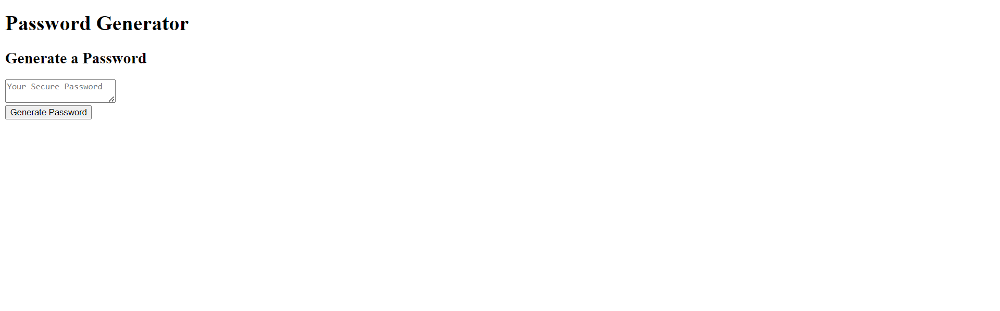

# password-generator
## Description

This website helps to generate safe random password. By answering few questions user will get a safe and secure password. 

## Installation

N/A

## Usage
To generate a password, user must press button generate passwotd and then answer the following questions: 
How many characters do you want your password to be? choose a number between 8 and 128 characters
Do you want to use lower case letters?
Do you want to use upper case letters?
Do you want to use numbers?
Do you want to use any special characters?

After answering all questions user will get their random password

Website URL: 

## Credits

Used module 3 mini project as reference. 

Used to see how to define password criteria : 
https://dev.to/code_mystery/random-password-generator-using-javascript-6a
https://webdesign.tutsplus.com/build-a-configurable-random-password-generator-with-javascript--cms-93262t

## License

Please refer to the LICENSE in the repo.